  

  

## About Me

I'm a **Full-Stack Software Engineer**, **AI Engineer**, **Cloud Computing Enthusiast**, and **Project Manager**. I build scalable solutions that blend creativity, collaboration, and modern tech, and I'm driven by solving real-world problems in fast-paced environments.

**Portfolio:** [shinya.live](https://www.shinya.live/) · **Fun fact:** I've got an **offline survival manual** on my phone, just in case. 🧭

When I'm not coding:
- **Watching & discussing** anime, manga, and cartoons (and writing reviews). _Top 3: Cowboy Bebop, Steins;Gate, Vagabond._
- **Listening to (and sometimes making) music.**
- **Dancing** and playing **video games** (competitive and story-driven). 

  
  
  
  

---

## 🛠️ Skills  

**I'm always eager to learn and adapt to new technologies on the go!**

  

| Category | Technologies |
|----------|--------------|
| **Programming Languages** | Java (17), Python, C++, C#, JavaScript, TypeScript, Swift, Bash, SQL |
| **Web & Frontend** | HTML, CSS, React, Next.js, Vite, Tailwind CSS, Three.js, shadcn/ui, Webflow, Webstudio, Framer Motion |
| **Backend & Integrations** | Spring Boot 3, Spring Security, JWT, Node.js, Express, FastAPI, Flask, GraphQL, Firebase, Payload CMS, Prisma, TypeORM, OpenAPI/Swagger, REST API, Clerk, Mapbox, Apollo, GA4, PostHog, Make.com, n8n, Sharp |
| **Databases** | PostgreSQL, Supabase, pgvector, Firestore, MongoDB, Redis, SQLite, MySQL, SwiftData, Flyway, SQLAlchemy, Alembic |
| **Cloud & DevOps** | AWS (S3, ECS Fargate, ECR, SageMaker, Lambda@Edge, Bedrock), GCP, Azure, Vercel, Docker, Terraform, Ansible, GitHub Actions, Linux, Git, GitHub |
| **AI & Machine Learning** | LangChain, LangGraph, Gemini, AWS Bedrock (Claude, Cohere), RAG (pgvector), LLMs, PyTorch, TensorFlow/Keras, scikit-learn, Ultralytics (YOLOv8), Mask R-CNN, OpenCV, rasterio, SAHI, Shapely, SageMaker, Jupyter Notebook |
| **Robotics & Computer Vision** | ROS 2, MoveIt2, Nav2, SLAM Toolbox, Gazebo, py_trees, Computer Vision, Sensor Fusion |
| **Testing** | Playwright, Jest, React Testing Library, JUnit, Mockito, Selenium |
| **Agentic Coding & Tools** | Cursor, Claude Code, Lovable, Google Antigravity, Microsoft Copilot |
| **Design & Project Management** | Figma, Canva, Jira, Trello, Miro, Notion, Microsoft 365 |
| **Embedded & Game Dev** | Arduino, Unity |

---

## 📊 GitHub Stats

  
  

  

---

## 🎓 Education  

- **Bachelor of Information Technology**  
  - _RMIT University_  
  - _Minor: AI & Data Science_  
  - _Expected Graduation: December 2026_  

---

## Professional Experience

### Co-Technical Lead, Founding Software Engineer @ [Orbitify](https://olanding-personal.vercel.app/)

📍 _Mar 2025 - Present_  
💼 **One Platform, AI-Powered, for Planning & Design**

- **Description:** Orbitify provides the AI tools and cloud infrastructure to build, scale, and optimize a more sustainable future. A unified platform for planning, inspections, field teams, and assets, from pre-construction to operations, for Energy, Manufacturing, Construction, Data Centers, Smart Cities, and more.
- **Role:** Co-Technical Lead, Founding Software Engineer  
- **Tech Stack (summary):** React, TypeScript, Vite, Tailwind CSS, Three.js, Mapbox, Java 17, Spring Boot 3, PostgreSQL (pgvector), Redis, Python, FastAPI, TensorFlow, YOLOv8, LangChain/LangGraph, AWS Bedrock, AWS (ECS Fargate, ECR, S3, SageMaker, Lambda@Edge).

#### Details
- **Full-Stack Integrated Platform:** Engineered a multi-tenant modular platform (React/Spring Boot) spanning O-EAM (asset & lifecycle), O-OPS (operations), O-DMS (document management), and O-EYE (AI-powered inspection), unifying planning, design, field workflows, and operations in one system.
- **GIS & Photogrammetry:** Architected a spatial system (Mapbox) and async Spring Boot APIs to process, stitch, and visualize large-scale drone survey orthomosaics via NodeODM.
- **Geospatial & 3D Visualization:** Built interactive 3D visualizers (Three.js/Framer Motion) to map topology. Developed Java spatial algorithms mapping AI 2D bounding boxes to geographic coordinates.
- **AI Anomaly Pipeline:** Designed a computer vision integration (Python/FastAPI/YOLOv8) mapping AI-detected damage to the frontend, autonomously generating maintenance Work Orders.
- **Intelligent AI Agent:** Embedded an AWS Bedrock-powered AI Agent (OChatbot) aiding operators with contextual insights, conversational data queries, and incident resolution.
- **Security & Multi-Tenancy:** Implemented robust RBAC and multi-tenancy using Spring Security/JWT for granular control over organizations, departments, roles, and feature flags.
- **Performance & Accessible UI:** Optimized dashboard state with React Query, building a reusable, accessible UI component library using Tailwind CSS and shadcn/ui.
- **Digital Operations:** Engineered field auditing engines for digitized checklists and automated PDF generation, unified with custom Incident and Work Order workflows.
- **Global Inventory System:** Developed Warehouse & Inventory modules leveraging PostgreSQL and Redis caching for granular tracking of global assets and spare parts.
- **Marketing Presence:** Designed and developed the Orbitify landing pages, building a responsive, high-converting marketing site.

#### 🔧 Tech Stack (by area)
- **Backend:** Java 17, Spring Boot 3, Spring Security, JWT, PostgreSQL, Flyway, pgvector, Redis, AWS SDK (S3, Bedrock), OpenAPI/Swagger.
- **Inference & CV:** Python, FastAPI, TensorFlow/Keras, Mask R-CNN, OpenCV, rasterio.
- **AI Agent (OChatbot):** Python, FastAPI, LangGraph, LangChain, AWS Bedrock (Claude, Cohere embed/rerank), SQLAlchemy, PostgreSQL, Alembic.
- **Object detection:** Python, FastAPI, Ultralytics (YOLOv8), SAHI, Shapely; model training on AWS SageMaker.
- **Infra:** Docker, AWS (ECS Fargate, ECR, S3, SageMaker, Lambda@Edge), Node.js + Sharp for image resize.

#### **Technologies Used:**  
  

    
  
  

---

### Software Engineer @ [RAIsE Hub | RMIT University](https://www.shinya.live/work/internbot)

📍 _Feb 2026 - Jun 2026 · Hybrid, Melbourne_  
💼 **Full-Stack AI Production Systems & Engineering Boilerplate**

- **Description:** Led end-to-end delivery of enterprise internship platforms and codified deployment architectures into reusable engineering tools for future RAIsE Hub client projects.
- **Role:** Software Engineer · Tech Lead (Internbot)  
- **Tech Stack:** Next.js 16, React 19, TypeScript, Cloud Functions v2, Firestore, Firebase Auth, Gemini 2.0 Flash, Supabase pgvector, Terraform, GitHub Actions, Docker

#### Details
- **Internbot:** Led a 5-person team to architect an internship platform serving **2,000+ students**; 100% sprint completion across 5 agile sprints (176 story points).
- **interbotRAG:** Standalone AI microservice on Cloud Functions v2 using **Gemini 2.0 Flash** and **Supabase pgvector** for semantic RAG with direct citations; Contract & Job compliance checkers and AI Email Manager.
- **Architecture:** CQRS + 4-layer Clean Architecture with Firestore Unit of Work transactions; **87% test coverage** with an **80% CI/CD gate** (35+ automated tests).
- **Garage Boilerplate:** Production-ready Next.js 16 + Firebase monorepo with Claude Code AI harness, custom MCP servers, Terraform, and Docker emulator stack for local-to-production parity.
- **DevOps:** Zero-downtime GCP deployments via Terraform and GitHub Actions with **OIDC Workload Identity Federation** (no long-lived service account keys).

#### **Technologies Used:**  
  

    
  

---

### Full Stack Software Engineer @ Project Pluto

#### [**GreenBook**](https://www.makegreenbook.com/)  
📍 _Nov 2024 - Aug 2025_  
💼 **A Project at Project Pluto**  
- **Description:** A sustainability-focused platform transforming traditional print marketing into data-driven digital experiences. Includes visual and programmatic workflows for managing digital assets with full automation of project setup, deployment, and analytics.
- **Role:** Lead Full-Stack Software Engineer  
- **Impact:** Reduced manual workload by 40%, integrated GA4/PostHog for analytics, supported API integrations for CMS, CRM, and asset management.
- **Technologies Used:**  
  

    
  
  

#### [**KOTO - Know One Teach One**](https://www.koto.com.au/news-media)  
📍 _Jan 2025 - Apr 2025_  
💼 **Media Center & Blog Platform for Social Impact**  
- **Description:** A digital media center and blog platform supporting KOTO’s mission to empower at-risk youth through hospitality training.  
- **Role:** Full-Stack Developer  
- **Impact:** 12K+ visitors; deployed responsive media/blog site using Payload CMS and Webstudio; optimized for mobile and accessibility.  
- **Technologies Used:**  
  

    
  
  

#### [**Newing Website**](http://brochure.newing.vn/)  
📍 _Feb 2025 - Mar 2025_  
💼 **Corporate Website & Analytics Dashboard**  
- **Description:** A clean, professional website for Newing, integrated with GreenBook’s backend for analytics and marketing content automation.  
- **Role:** Frontend Developer  
- **Impact:** 10K+ visitors; improved content visibility through integrated dashboards and shared analytics.  
- **Technologies Used:**  
  

    
  
  

#### [**Sustainability Impact Challenge 2025**](https://sic.makegreenbook.com/)  
📍 _Mar 2025 - Apr 2025_  
💼 **Event Microsite for RMIT Vietnam**  
- **Description:** A microsite for RMIT’s flagship sustainability event, built for accessibility and scale.  
- **Role:** Full-Stack Developer  
- **Impact:** 1K+ visitors; delivered a performance-optimized and easy-to-maintain platform for a university-led sustainability initiative.  
- **Technologies Used:**  
  

    
  
  

#### [**Alumni Impact Showcase 2025**](https://www.rmitalumnishowcase.com/)  
📍 _Apr 2025 - Jun 2025_  
💼 **Global Alumni Recognition Platform - RMIT Vietnam**  
- **Description:** A Webflow-based platform highlighting 130+ alumni-led projects from around the globe.  
- **Role:** Web Developer & Automation Lead  
- **Impact:** 50K+ views, 24K+ returning visitors; automated nomination workflows using Make.com and built an elegant UX for content discovery.  
- **Technologies Used:**  
  

    
  
  

---

## 💻 Projects  

### 🤖 Robotics & AI

#### [**Autonomous Xiangqi-Playing UR5e Cobot**](https://github.com/giatinhuynh/par_ur5e_xiangqi)  
📍 _Apr 2026 - Jun 2026_  
♟️ **Physical Chinese Chess on a Universal Robots UR5e**

- **Description:** Autonomous Xiangqi system playing full physical games against humans — three-tier ROS 2 stack, dual-model computer vision, and behavior tree-driven manipulation with RG2 gripper and Intel RealSense.
- **Role:** Robotics Software Engineer & AI Developer  
- **Impact:** Full hardware game loop — vision → AI move → pick-and-place → board verify; Fairy-Stockfish + custom Minimax engines; Flask/Socket.IO live dashboard.
- **Technologies Used:**  
  

    
  

#### [**Autonomous Search & Navigation ROSBot**](https://github.com/giatinhuynh/par_group11_tin)  
📍 _Feb 2026 - Mar 2026_  
🗺️ **RMIT Search & Navigation Challenge**

- **Description:** Autonomous exploration and hazard mapping on ROS 2 Humble — maps unknown environments, localizes visual hazards in 3D, and retraces its path home.
- **Role:** Robotics Software Engineer  
- **Impact:** Custom 3-node stack (FSM, Hazard Detection, Position Tracking) on Nav2 + SLAM Toolbox + explore_lite; RGB-D spin-pause depth sampling via OAK-D camera.
- **Technologies Used:**  
  

    
  

---

### Full-Stack Applications  

#### [**Internbot & interbotRAG**](https://www.shinya.live/work/internbot)  
📍 _Feb 2026 - Jun 2026_  
🎓 **Enterprise Internship Management & AI Platform · RAIsE Hub**

- **Description:** Full-stack internship platform serving **2,000+ RMIT students**, built for multi-university scalability. Standalone **interbotRAG** microservice automates policy FAQs and document compliance.
- **Role:** Tech Lead, AI Software Engineer & Scrum Master  
- **Impact:** 87% backend test coverage, 80% CI/CD gate, Gemini 2.0 Flash + pgvector RAG, Terraform zero-downtime GCP deployments.
- **Technologies Used:**  
  

    
  

#### [**OurList**](https://anime-duo-delight.vercel.app/)  
📍 _Nov 2025 - Present_  
❤️ **A Unified Hub for Couples' Entertainment Tracking**

- **Description:** A minimal, unified tracking platform born from a personal need to simplify entertainment management for couples. It centralizes anime, movies, books, music, and games into one clean hub, replacing fragmented tools like MyAnimeList, Letterboxd, and Goodreads.
- **Role:** Full-Stack Developer & Product Designer  

#### Details
- **Full-Stack Development & Architecture:** Architected a secure, private database backend using Supabase, giving users full ownership and control over their ratings, watch/read/play statuses, and future plans. Built a responsive, modern frontend with React, TypeScript, Tailwind CSS, and shadcn/ui. Engineered the application as a Progressive Web App (PWA), offering a native app-like, installable experience on mobile devices with cross-device syncing.
- **API Integrations & Synchronization:** Implemented seamless cross-platform synchronization by integrating external APIs (MyAnimeList, TMDB, Spotify). Developed an automated import pipeline that keeps external lists continuously synced without requiring manual re-logins or repetitive data entry.
- **Product Strategy & UX/UI:** Designed an ad-free, clutter-free user experience tailored specifically for couples to easily share favorites and discover new media together. Shifted focus to a "build for yourself first" philosophy, prioritizing actual user friction points over bloated feature sets.

#### 🔧 Tech Stack
- **Frontend:** React, TypeScript, Tailwind CSS, shadcn/ui, PWA  
- **Backend & DB:** Supabase (PostgreSQL, Auth)  
- **Integrations:** MyAnimeList API, TMDB API, Spotify API  

#### **Technologies Used:**  
  

    
  
  

#### [**TeachTeam - Tutor Application System**](https://github.com/giatinhuynh/s3954173-s3962053-a2)  
📍 _Apr 2025 - Jun 2025_  
💼 **Full-Stack Application for RMIT’s Web Systems & Technologies Course**

- **Description:** A robust and production-grade tutor application system built with a scalable full-stack architecture. The platform includes a public-facing portal, a role-based dashboard for tutors and lecturers, and a separate admin dashboard with GraphQL support for administrative functions.  
- **Role:** Full-Stack Developer & Testing Lead  
- **Impact:** Implemented end-to-end authentication, role-based dashboards, GraphQL real-time notifications, and 46 comprehensive test cases across key features and flows.

#### 🔧 System Architecture
- **Frontend:** React, TypeScript, Next.js  
- **Backend API:** Node.js, Express, TypeORM, MySQL  
- **Admin Dashboard:** React with Apollo GraphQL & Subscriptions  
- **Database:** Cloud-hosted MySQL  
- **Testing:** Jest, React Testing Library (46 tests in total)

#### 🚀 Key Features
- **Role-Based Dashboards:** Dedicated UIs for candidates, lecturers, and admins  
- **REST + GraphQL API:** RESTful APIs for public use, GraphQL for admin operations  
- **Real-Time Notifications:** Admin gets notified via WebSockets when candidate availability changes  
- **Advanced Filtering:** Lecturer dashboard supports multi-layered filters (availability, skill set, session type, etc.)  
- **Application System:** Full application lifecycle with status tracking and review tools  
- **Admin Reporting Suite:** Generate reports like multi-course candidates, unselected applicants, and course-tutor matching stats  
- **Security:** Full validation (DTOs, controller-level), route guards, and session/token management  
- **Test Coverage:** Authentication flow, route protection, role-based rendering, navbar states, and login edge cases

#### **Technologies Used:**  
  

    
  
  

#### [**CareerHub - Career Events Platform**](https://github.com/giatinhuynh/career-hubb)  
📍 _Aug 2025 - Nov 2025_  
💼 **Full-Stack Team Project for RMIT's Software Engineering Process & Tools Course**

- **Description:** An events-first platform where students discover career-oriented opportunities (career fairs, networking nights, workshops, panels, and hackathons), each with category-specific interactive features built for real professional outcomes.  
- **Role:** Scrum Master, Tech Lead & Full Stack Developer  
- **Impact:** Led a team of 5 to deliver a comprehensive career events platform with 504 passing tests, Docker containerization, and AWS cloud deployment.

#### 🔧 System Architecture
- **Frontend:** Next.js, React, TypeScript, Tailwind CSS, shadcn/ui  
- **Backend API:** Spring Boot (Java 17), JPA, PostgreSQL  
- **Infrastructure:** Docker, AWS (EC2, RDS, S3, ECR), GitHub Actions CI/CD  
- **Testing:** JUnit 5/Mockito (27 suites) + Jest/RTL (22 suites), 504 tests total

#### 🚀 Key Features
- **Category-Specific Events:** Career Fair booth directory with floor maps & 1:1 slots, Networking Night speed-rounds with icebreaker quests, Workshop guided runbooks with rubric scoring, Panel moderated Q&A with upvoting  
- **Core Platform:** Events & RSVP CRUD, role-based access, event discovery with filters  
- **DevOps:** Docker containerization, GitHub Actions CI pipeline, AWS ECR deployment  
- **Leadership:** Sprint planning, retrospectives, SRS documentation, architecture design, GitHub project board management

#### **Technologies Used:**  
  

    
  
  

#### [**RMatch**](https://github.com/giatinhuynh/RMatch)  
📍 _Sep 2024 - Nov 2024_  
🏆 **CSIT x SWITCH Hackathon - 2nd Place Winner**  
- **Description:** A web app connecting RMIT students with teammates, friends, and study partners via a Tinder-style matching system.  
- **Role:** Project Manager & Lead Developer  
- **Technologies Used:**  
  

    
  
  

#### [**Medea**](https://github.com/giatinhuynh/Medea)  
📍 _Aug 2024 - Nov 2024_  
🏆 **Swin Hackathon 2024 - Top 28 Finalist**  
- **Description:** An all-in-one AI-powered media production platform designed to streamline workflows for creative professionals.  
- **Role:** Full-Stack Developer & UI/UX Designer  
- **Technologies Used:**  
  

    
  
  

#### [**Student Check-In Web App**](https://github.com/RMIT-FinTech-Club/Check-in-System)  
📍 _Jul 2023 - Feb 2024_  
- **Description:** A web app automating event check-in processes by streamlining data entry with advanced backend automation.  
- **Role:** Backend Developer  
- **Key Contributions:**  
  - Built data manipulation workflows using **Python** and **Selenium** for automated processing.  
  - Integrated **OpenCV** for enhanced data accuracy and validation.  
  - Tested in real-time during school events, successfully processing over **200+ entries** with minimal errors.  
- **Technologies Used:**  
  

    
  
  

---

### 🤖 AI & Machine Learning

#### [**Colon Histopathology AI Classifier**](https://github.com/giatinhuynh/colon-histopathology-classifier)  
📍 _Apr 2026 - Jun 2026_  
🔬 **Cancer Detection & Cell-Type Classification · CRCHistoPhenotypes**

- **Description:** End-to-end ML research pipeline for colon cell cancer detection and 4-class cell-type classification on 27×27 histopathology patches, with rigorous **patient-level** evaluation on unseen clinical data.
- **Role:** Machine Learning Engineer & Data Scientist  
- **Impact:** **0.91 Macro F1** (cancer detection) and **0.75 Macro F1** (cell-type) on held-out patients; 12 models (SVM, RF, custom CNNs); documented negative transfer from CIFAR-10 pretraining.  
- **Links:** [GitHub](https://github.com/giatinhuynh/colon-histopathology-classifier) · [Kaggle Notebook](https://www.kaggle.com/code/hunhcgiatn/colon-histopathology-classifier)  
- **Technologies Used:**  
  

    
  

#### [**Adversarial LLM Security: Blue & Red Team**](https://github.com/giatinhuynh/RMIT-CyberHack2025)  
📍 _Feb 2025_  
🏆 **RMIT GenAI & Cyber Security Hackathon 2025, Melbourne Campus Winner**  
- **Description:** Blue Team (Challenge 2): jailbreak prompt detection on a 5,000-sample dataset. Red Team (Challenge 4): stress-testing Microsoft Azure OpenAI safety filters with ultra-advanced adversarial prompts. Part of the winning Melbourne campus team (600+ participants, 70+ teams).  
- **Role:** Blue Team lead (ensemble ML), Red Team (adversarial prompt design & API testing)  
- **Impact:** Blue Team: hybrid TF-IDF + BERT ensemble (DistilBERT, RoBERTa, DeBERTa) with early stopping and dynamic ensemble weighting; high validation AUCs. Red Team: 2 of 5 ultra-advanced prompts bypassed Azure OpenAI filters, revealing key LLM safety vulnerabilities.  
- **Technologies Used:**  
  

    
  

---

### Java Applications  

#### [**Port Management System**](https://github.com/giatinhuynh/COSC2081_team_2)  
📍 _Aug 2023 - Oct 2023_  
- **Description:** A Java-based platform to track port resources, vehicle logs, and fuel consumption with CRUD functionality.  
- **Role:** Team Leader  
- **Technologies Used:**  
  

    
  
  

#### [**The Reading Room**](https://github.com/giatinhuynh/thereadingroom)  
📍 _Aug 2024 - Nov 2024_  
- **Description:** A bookstore management system enabling seamless book inventory, order tracking, and user management.  
- **Role:** Developer  
- **Technologies Used:**  
  

    
  
  

---

### 📱 iOS Applications

#### [**Know Thyself - iOS Self-Reflection App**](https://github.com/giatinhuynh/know-thyself)  
📍 _2025_  
💼 **iOS Application for RMIT's iPhone Software Engineering Course**

- **Description:** A comprehensive iOS app designed to facilitate daily self-reflection and personal growth through structured questioning, AI-powered insights, and pattern recognition. Built to professional App Store standards with widget extensions, UIKit integration, and LLM-powered personalization.  
- **Role:** iOS Developer & AI Integration Lead  
- **Impact:** Delivered a production-grade iOS app with widget extensions, Gemini API integration, custom gestures, and comprehensive DocC documentation.

#### 🔧 Architecture
- **Framework:** SwiftUI with MVVM pattern and ObservableObject state management  
- **Data:** SwiftData (local) + Firebase (cloud) dual persistence  
- **AI:** Google Gemini API for personalized psychological insights  
- **Testing:** 10 unit tests covering core functionality, data models, and business logic

#### 🚀 Key Features
- **Reflection Modes:** Daily (10 questions) and Full (50+ questions across 9 life areas)  
- **AI-Generated Insights:** Pattern recognition, growth recommendations, and personalized summaries  
- **Widget Extension:** Home screen widget with streak tracking, quick actions, and App Group data sharing  
- **Rich Text Editor:** UIKit-integrated via UIViewControllerRepresentable for formatted journaling  
- **Mindful Tab:** Custom multi-gesture breathing exercises with visual and haptic feedback  
- **Custom Layouts:** TagCloudLayout and AppLogoLayout protocol implementations

#### **Technologies Used:**  
  

    
  
  

---

### 🎮 Game Development Projects

#### [**Rising Waters: Flood Crisis Management Simulator**](https://github.com/giatinhuynh/RMIT-CyberHack2025/tree/main/game_submission)  
📍 _Feb 2025_  
🏆 **RMIT GenAI & Cyber Security Hackathon 2025, Melbourne Campus Winner (Challenge 3)**  
- **Description:** Web-based strategic simulation game for flood crisis management. Players lead a community through 8 rounds, balancing Safety, Infrastructure, Morale, and Resource Points across 3 regional scenarios (Central Highlands, Hanoi Lowlands, Mekong Delta).  
- **Role:** Game Developer  
- **Impact:** Delivered an educational, accessible (WCAG 2.1 AA-oriented) game with EN/VI support; JSON-driven scenarios and responsive UI.  
- **Technologies Used:**  
  

    
  

#### [**Frog Game & Connect Four AI - Unity Game AI Project**](https://github.com/giatinhuynh/gai-a2)  
📍 _Mar 2025 - Jun 2025_  
💼 **Course Project for COSC2527 / COSC3144 - RMIT University**

- **Description:** A Unity-based dual-game project demonstrating advanced artificial intelligence techniques in both real-time navigation and turn-based strategy. Includes a survival game ("Frog Game") and a multi-agent Connect Four implementation.  
- **Role:** Lead Game AI Developer & Systems Architect  

#### 🐸 Frog Game
- **Behavior Tree AI:** Modular decision-making with conditionals, actions, and blackboard system  
- **Advanced Pathfinding:** A* algorithm with 5+ heuristic types and dynamic terrain cost handling  
- **AI Combat System:** Auto-targeting and threat response against enemies (snakes)  
- **Environmental Awareness:** Terrain-aware movement, predictive targeting, and path caching  
- **Debug & Optimization:** Real-time behavior visualization, performance metrics, and stuck detection  

#### 🎯 Connect Four AI
- **Allis Agent:** Implements Victor Allis's expert strategy (9 rule types + Zugzwang detection)  
- **Minimax with Alpha-Beta Pruning:** Iterative deepening, Zobrist hashing, and time-limited depth  
- **Monte Carlo Tree Search (MCTS):** Simulation-based agent with UCB1  
- **Other Agents:** Rule-based, Random, and Human-controlled agents  
- **Gameplay Customization:** Configurable board size, win conditions, agent matchups  

#### **Technologies Used:**  
  

    
  
  

#### [**Soneat Generation 3: Reinforcement Belief**](https://github.com/giatinhuynh/gai-a3)  
📍 _Apr 2025 - Jul 2025_  
💼 **AI-Powered Game Project for COSC2527 / COSC3144 - RMIT University**

- **Description:** A Unity-based endless runner game blending Sonic-inspired gameplay with advanced neuroevolutionary AI. Features dual gameplay modes: manual play and AI learning via NEAT (NeuroEvolution of Augmenting Topologies), with support for real-time training, multi-agent simulation, and neural network visualization.  
- **Role:** Team Leader & Core Systems Developer  

#### 🧠 NEAT AI System
- Full NEAT implementation with real-time evolution, species management, and dynamic topology updates  
- 12-input vision system for obstacle detection, speed adaptation, and combo pattern analysis  
- Save/load AI models with training metadata and visualized neural networks

#### 🏃 Gameplay Highlights
- Chrome Dino-inspired progression with boss battles, combo obstacle clusters, and dynamic difficulty scaling  
- Two gameplay modes: **Human-Controlled** and **AI Training Mode** with up to 50 agents  
- Classic Sonic-style movement with animated sprites, terrain effects, and adaptive music

#### 🛠 Technical Highlights
- Modular architecture: `GameManager`, `ObstacleManager`, `Population`, `BossManager`  
- Performance-optimized: Object pooling, fast-forward training, memory-efficient collision  
- Boss system with multi-phase attacks, visual indicators, and training-aware AI behavior

#### **Technologies Used:**  
  

    
  
  

---

### IoT Innovations  

#### [**Sky Garden**](https://github.com/giatinhuynh/COSC2500-Sky-GardenIoT-A4-11)  
📍 _Sep 2023 - Oct 2023_  
- **Description:** Advanced automated greenhouse system using IoT to improve sustainable farming practices.  
- **Role:** IoT Developer & Team Leader  
- **Technologies Used:**  
  

    
  
  

#### [**Automated Greenhouse System**](https://github.com/giatinhuynh/green-house-system)  
📍 _Jul 2023 - Aug 2023_  
- **Description:** A smart system combining adaptive watering, climate control, and real-time monitoring for efficient plant care.  
- **Role:** IoT Developer & Team Leader  
- **Technologies Used:**  
  

    
  
  

---

### General Software Projects  

#### [**Electoral Database Management System**](https://github.com/giatinhuynh/victoriavotingsystem)  
📍 _Jul 2024 - Sep 2024_  
- **Description:** A comprehensive database solution designed to manage and optimize federal electoral processes, including voter registration, ballot issuance, and result aggregation.  
- **Role:** Database Developer  
- **Key Contributions:**  
  - Designed and implemented a scalable database schema using **ER modeling** and **SQL Server**.  
  - Optimized complex queries for reporting and analysis, including identifying non-voters and generating randomized candidate lists.  
  - Developed stored procedures to automate tasks such as vote counting and preference redistribution.  
  - Enhanced database scalability by applying **table partitioning** and **indexing techniques** for efficient data handling.  
- **Technologies Used:**  
  

    
  
  

#### [**Otaku Universe**](https://github.com/giatinhuynh/Otaku-Universe)  
📍 _Jul 2023 - Aug 2023_  
- **Description:** Online bookstore and community hub for fans of manga and light novels worldwide.  
- **Role:** Developer  
- **Technologies Used:**  
  

    
  
  

#### [**Cookery**](https://github.com/giatinhuynh/Cookerynoserver)  
📍 _Mar 2023 - May 2023_  
- **Description:** AI-powered chatbot providing personalized recipe recommendations and culinary tips.  
- **Role:** Developer  
- **Technologies Used:**  
  

    
  
  

#### [**Kookasap**](https://github.com/giatinhuynh/Kookasap)  
📍 _Oct 2022 - Dec 2022_  
- **Description:** A recipe recommendation platform using responsive design principles.  
- **Role:** Developer  
- **Technologies Used:**  
  

    
  
  

---

## 🤝 Connect and Collaborate  

I firmly believe in fostering **growth**, maintaining **clear communication**, and cultivating **teamwork** to achieve outstanding results. Let’s connect and collaborate to build innovative solutions, share knowledge, and grow together!  

  
  
  
  

  

💡 **"Innovating at the crossroads of technology, creativity, and problem-solving."**  
